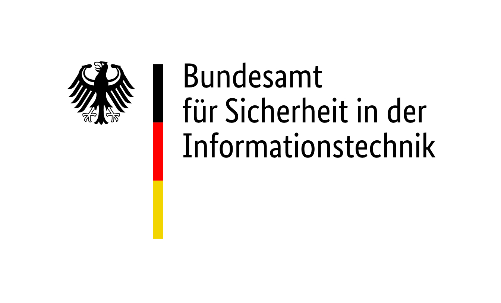
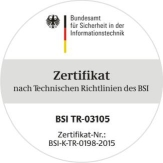

# Einführung
Willkommen auf dem Internet-Portal der Open Source Community zu PersoSim, dem Simulator für den neuen elektronischen Personalausweis (nPA oder ePA). PersoSim dient dazu, die Softwareentwicklung für die Nutzung des neuen Personalausweises voranzutreiben. Dazu möchte das Projekt Entwickler, Unternehmen und Behörden in dieser Community zusammenbringen. PersoSim ist ein Mosaikstein im Testkonzept des BSI für die eID-Infrastruktur. Die [Testinfrastruktur](https://www.bsi.bund.de/DE/Themen/Oeffentliche-Verwaltung/Elektronische-Identitaeten/Online-Ausweisfunktion/Testinfrastruktur/testinfrastruktur_node.html) beschreibt die einzelnen Komponenten innerhalb der eID-Infrastruktur wie bspw. [PersoSim](https://www.bsi.bund.de/DE/Themen/Oeffentliche-Verwaltung/Elektronische-Identitaeten/Online-Ausweisfunktion/Testinfrastruktur/PersoSim/PersoSim_node.html) und informiert über die Testmöglichkeiten sowie die dazugehörigen Testwerkzeuge. Interessierte Anwender und Entwickler sind natürlich herzlichst eingeladen, sich an der PersoSim-Community auf unterschiedliche Weise einzubringen. Die GitHub-Repositories mit dem Quellcode und weiteren Informationen für Entwickler liegen hier: https://github.com/PersoSim.

Bei Fragen zu PersoSim ist unsere [FAQ](FAQ.md) hilfreich, die wir ständig erweitern. Sollte sich die Frage dort nicht klären lassen, sind wir über unsere Support-Adresse support@persosim.de erreichbar und versuchen, alle Fragen bzgl. PersoSim zu beantworten. Gerne nehmen wir darüber auch Ideen zur Verbesserung oder Erweiterungswünsche auf.

 

## Zielgruppe
Die Zielgruppe dieser Online-Hilfe sind:
- Anwender von PersoSim.
- Entwickler, für die zusätzliche Infos zum Projekt im dazugehörigen Repository auf GitHub bereitstehen: [https://github.com/PersoSim/PersoSim](https://github.com/PersoSim/PersoSim) 

 

## Projektstatus der Online-Hilfe
- Version: V.1.6.0

 

## Sponsor und Zertifizierung
Das Projekt PersoSim wird finanziert durch das Bundesamt für Sicherheit in der Informationstechnik (BSI). PersoSim ist wie andere physische Personalausweise auch nach TR-03105 Teil 3.3 zertifiziert und entspricht somit den Vorgaben des BSI für hoheitliche Dokumente.

  

Umsetzung durch: secunet Security Networks AG  

  